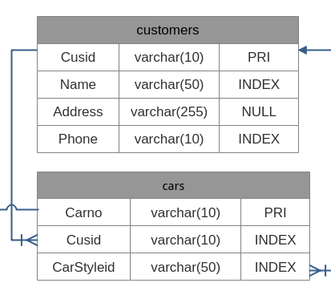

#### 課後綜合練習(一)
##### 說明
+ 本練習只記錄要點，細節部份請自行參閱上課內容
+ 程式範例放置網址 : https://github.com/antallen/PHPproject.git
+ 開發環境建立
  + Windows 環境
    + 安裝 Visual Studio Code
    + 安裝 Visual C++ 可轉發套件
    + 安裝 PHP
      + 下載 PHP for windows 的 VC zip 套件
      + 解壓後，放到想要放置的目錄
      + 設定環境變數 path 值，加入 PHP 執行檔(php.exe)所在的目錄
    + 安裝 composer 
  + Linux 環境 (CentOS 7/8)
    + 安裝 epel-release
    + 安裝 Visual Studio Code
    + 安裝 php 相關模組套件
    + 安裝 composer 以及 nodejs 相關模組套件
+ 正式環境建立
  + 請參考課程內容
+ 版控系統
  + 請使用 github 

##### 建立 Laravel 專案
+ 在 github 建立一個新的 PHPproject 專案
+ 指定目錄，用以建立專案！
  ```bash
  $ composer create-project --prefer-dist laravel/laravel PHPproject
  ```
+ 執行 Git 初始化
  ```bash
   $ cd PHPproject
   $ git init .
  ```
+ 上傳 PHPproject 專案
  ```bash
  $ git add .
  $ git commit -m "First Build"
  $ git remote add origin https://github.com/你的帳號/PHPproject.git
  $ git push -u origin master
  ```

##### 將專案 PHPproject 下載到正式站台
+ 以 root 身份登入正式環境的系統
+ 切換目錄
  ```bash
  # cd /usr/share/nginx/html
  ```
+ 複製 github 上的 PHPproject 專案
  ```bash
  # git clone https://github.com/你的帳號/PHPproject.git
  ```
+ 安裝需要的套件
  ```bash
  # yum install php-xml rsyslog
  # systemctl restart rsyslog
  # systemctl restart php-fpm
  ```
+ 使用 Composer，將套件裝齊
  ```bash
  # cd PHPproject
  # composer install
  ```
+ 修改權限設定
  ```bash
  # chown -R nginx /usr/share/nginx/html/PHPproject
  # semanage fcontext -a -t httpd_sys_rw_content_t "/usr/share/nginx/html/PHPproject/storage(/.*)?"
  # semanage fcontext -a -t httpd_sys_rw_content_t "/usr/share/nginx/html/PHPproject/resources(/.*)?"
  # restorecon -Rvv /usr/share/nginx/html/PHPproject
  ```
+ 產生 .env 檔案 (內容先不要修改)
  ```bash
  # cp .env.example .env
  # nano .env
  ```
+ 設定加密 key
  ```bash
  # php artisan key:generate
  ```
+ 修改 nginx 設定檔 default.conf
  ```bash
  # nano /etc/nginx/conf.d/default.conf
  (修改內容如下：)
  root /usr/share/nginx/html/PHPproject/public;
  ```
+ 重新啟動 Web Server
  ```bash
  # nginx -t
  # nginx -s reload
  ```
+ 在開發環境，使用瀏覽器查看網頁
  + 網址 : http://你的正式環境IP

##### 使用 Migration 建立資料表
+ 資料表規劃
  
  + 先規劃兩個表格，後續再追加！
  + 表格 customers
    |欄位名稱|資料類型|參數設定|說明|
    |:---:|:---:|:---:|:---|
    |Cusid|varchar(20)|PRI|客戶編號|
    |Name|varchar(50)|INDEX|客戶名稱|
    |Address|varchar(255)|NULL|客戶地址|
    |Phone|varchar(10)|INDEX|客戶電話|
  + 表格 cars
    |欄位名稱|資料類型|參數設定|說明|
    |:---:|:---:|:---:|:---|
    |Carno|varchar(10)|PRI|車牌號碼|
    |Cusid|varchar(20)|INDEX|客戶編號|
    |CarStyleid|varchar(50)|INDEX|汽車款式編號|

+ 設定資料庫與使用者
  + 登入正式環境主機
  + 安裝資料庫的方法，請參閱教材
  + 使用 root 帳號登入資料庫
    ```bash
    # mysql -u root -p
    ```
  + 新增資料庫 cars
    ```bash
    mysql> CREATE DATABASE cars;
    ```
  + 新增使用者與授權
    ```bash
    mysql> CREATE USER 'peter'@'localhost' IDENTIFIED BY 'Aa12345678!';
    mysql> GRANT ALL PRIVILEGES ON cars.* TO 'peter'@'localhost';
    mysql> FLUSH PRIVILEGES;
    mysql> quit;
    ```

+ 修改 Laravel 環境設定檔
  + 登入正式機後，修改 .env 設定檔
    ```bash
    # nano /usr/share/nginx/html/PHPproject/.env
    (只修改以下參數)
    DB_CONNECTION=mysql
    DB_HOST=127.0.0.1
    DB_PORT=3306
    DB_DATABASE=cars
    DB_USERNAME=peter
    DB_PASSWORD=Aa12345678!
    ```

+ 建立 Migration
  + 使用開發環境
  + 利用 artisan 來初始化 migration
    ```bash
    $ php artisan make:migration create_customers_table
    ```
  + 編寫 PHPproject/database/migratins/(一堆時間)_create_customers_table.php 內容
    ```php
    //前面略過
    public function up()
    {
      Schema::create('customers', function (Blueprint $table)
      {
        //$table->bigIncrements('id'); 這欄位會形成 Primary Key，所以註解
        $table->char('Cusid',20)->primary();
        $table->char('Name',50)->index();
        $table->char('Address',255)->nullable();
        $table->char('Phone',10)->index();
        //協助建立追踪的時間
        $table->timestamps();
      });
    }
    //後面也略過
    ```
  + 寫好存檔後，送上 github !

+ 在正式環境操作 Migration
  + 登入正式環境
  + 進入 PHPproject 目錄
    ```bash
    # cd /usr/share/nginx/html/PHPproject
    ```
  + 取回 PHPproject 異動的檔案
    ```bash
    # git pull origin master
    ```
  + 使用 Migration 建立資料表
    ```php
    # php artisan migrate
    # php artisan migrate:status
    ```
  + 查看資料庫內是否建好資料表
    ```php
    # mysql -u peter -p
    mysql> show databases;
    mysql> use cars;
    mysql> show tables;
    mysql> show columns from customers;
    mysql> exit
    ```

##### 使用  Eloguent 操作資料表內容
+ 建立 Eloguent 
  + 使用開發環境
  + 建立 Eloguent 關連 customers 資料表
    ```bash
    $ php artisan make:model Customer
    ```
  + 編寫 app/Customer.php 檔案
    ```php
    <?php
    namespace App;
    use Illuminate\Database\Eloquent\Model;
    
    class Customer extends Model {
      //定義相關連結的資料表
      //如果有依照命名規則，此行程式不必撰寫
      protected $table = 'customers';
      //定義主鍵的欄位
      //如果有依照命名規則，此行程式不必撰寫
      protected $primarykey = 'Cusid';
      //如果沒有設定 created_at 與 updated_at欄位，則可以設成 false
      public $timestamps = true;
    }
    ```

##### 建立控制器連接 Eloguent
+ 建立控制器
  + 使用開發環境
  + 利用 artisan 建立 CustomerController
    ```bash
    $ php artisan make:controller CustomerController 
    ```
  + 編修 app/Http/Controllers/CustomerController.php
    ```php
    <?php
    namespace App\Http\Controllers;
    use Illuminate\Http\Request;
    use Route;
    use View;
    use App\Customer;
    class CustomerController extends Controller
    {
      public function index() {
        $customers = Customer::all();
        return View::make('board',['customers' => $customers]);
      }
    }
    ```

##### 指定路由
+ 設定路由
  + 使用開發環境
  + 編修 routes/web.php 檔案
    ```php
    //增加下列程式內容
    Route::resource('customer', 'CustomerController');
    ```

##### 建立 View 與 Blade 樣板
+ 建立 View
  + 使用開發環境
  + 編修共同使用的樣板區塊
    + resources/views/partials/head.blade.php
      ```php
      <!-- Required meta tags -->
      <meta charset="utf-8">
      <!-- Responsive meta tag -->
      <meta name="viewport" content="width=device-width, initial-scale=1, shrink-to-fit=no">
      <!-- Bootstrap CSS -->
      <link rel="stylesheet" href="https://stackpath.bootstrapcdn.com/bootstrap/4.3.1/css/bootstrap.min.css" integrity="sha384-ggOyR0iXCbMQv3Xipma34MD+dH/1fQ784/j6cY/iJTQUOhcWr7x9JvoRxT2MZw1T" crossorigin="anonymous">
      ```
    + resources/views/partials/foot.blade.php
      ```php
      <!-- Optional JavaScript -->
      <!-- jQuery first, then Popper.js, then Bootstrap JS -->
      <script src="https://code.jquery.com/jquery-3.3.1.slim.min.js" integrity="sha384-q8i/X+965DzO0rT7abK41JStQIAqVgRVzpbzo5smXKp4YfRvH+8abtTE1Pi6jizo" crossorigin="anonymous"></script>
      <script src="https://cdnjs.cloudflare.com/ajax/libs/popper.js/1.14.7/umd/popper.min.js" integrity="sha384-UO2eT0CpHqdSJQ6hJty5KVphtPhzWj9WO1clHTMGa3JDZwrnQq4sF86dIHNDz0W1" crossorigin="anonymous"></script>
      <script src="https://stackpath.bootstrapcdn.com/bootstrap/4.3.1/js/bootstrap.min.js" integrity="sha384-JjSmVgyd0p3pXB1rRibZUAYoIIy6OrQ6VrjIEaFf/nJGzIxFDsf4x0xIM+B07jRM" crossorigin="anonymous"></script>
      ```
    + resources/views/partials/nav.blade.php
      ```php
      <nav class="navbar navbar-expand-lg navbar-light navbar-default">
        <div class="container">
          <a href="{{ url('/') }}" class="navbar-brand">
            專案站台
          </a>
          <ul class="navbar-nav ml-auto mt-2 mt-lg-0">
            <li class="nav-item active">
              <a href="{{ action('CustomerController@index') }}" class="nav-link">
                客戶列表
              </a>
            </li>
          </ul>
        </div>
      </nav>
      ```
  + 定義主要樣板網頁檔案
    + resources/views/layouts/master.blade.php
      ```php
      <!DOCTYPE html>
      <html>
      <head>
        <title>@yield('title')</title>
        @section('head')
          @include('partials.head')
        @show
      </head>
      <body>
        @include('partials.nav')
        <main class="py-4">
          <div class="container">
            @yield('content')
          </div>
        </main>
        @section('foot')
          @include('partials.foot')
        @show
      </body>
      </html>
      ```
  + 定義子樣板網頁檔案
    + resources/views/board.blade.php
      ```php
      @extends('layouts.master')
      @section('title','客戶列表')
      @section('content')
      <div class="row justify-content-center">
        <div class="col-md-10">
          <div class="card">
            <div class="card-header">客戶列表</div>
            <div class="card-body p-1">
              <table class="table table-hover m-0">
                <thead class="thead-darty">
                  <tr>
                    <th>客戶編號</th>
                    <th>客戶姓名</th>
                    <th>客戶電話</th>
                  </tr>
                </thead>
                <tbody>
                  <?php
                    foreach ($customers as $customer){
                  ?>
                    <tr>
                          <td><?php echo $customer->Cusid; ?></td>
                          <td><?php echo $customer->Name; ?></td>
                      <td><?php echo $customer->Phone; ?></td>
                    </tr>
                    <?php }  ?>
                </tbody>
              </table>
            </div>  
          </div>
        </div>
      </div>
      @stop
      ```

+ 上傳資料至 github
+ 到正式環境，取回更新的檔案